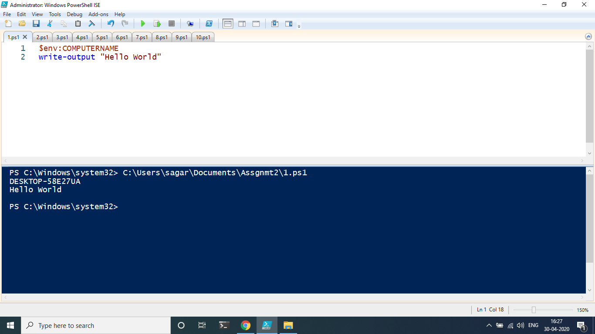
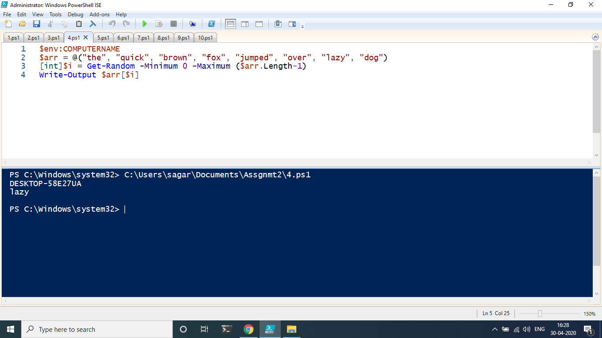
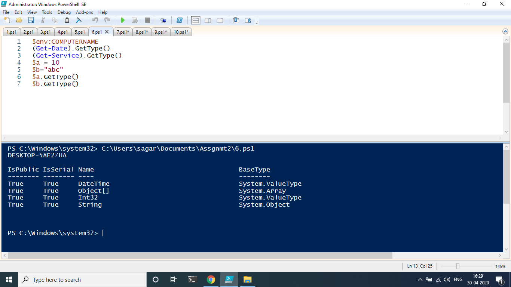
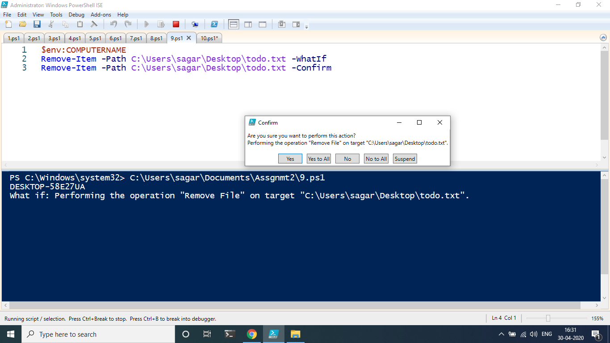

## Question : 1
#### Program :
```powershell
write-output "Hello World"
```
#### Screenshot :

## Question : 2
#### Program :
```powershell
function hello() {
    return "Hello World"
}
```
#### Screenshot :

## Question : 3
#### Program : 
```powershell
function RevString([string]$str) {
    $temp = $str.ToCharArray()
    [array]::Reverse($temp)
    $rev = -join($temp)
    return $rev
}
```
#### Screenshot :

## Question : 4
#### Program :
```powershell
$arr = @("the", "quick", "brown", "fox", "jumped", "over", "lazy", "dog")
[int]$i = Get-Random -Minimum 0 -Maximum ($arr.Length-1)
Write-Output $arr[$i]
```
#### Screenshot :

## Question : 5
#### Program :
```powershell
function GetDetails([switch]$psver, [switch]$osver) {
    if ($psver) {
        return Get-Host | select Version
    }
    if ($osver) {
        return [Environment]::OSVersion
    }
}
```
#### Screenshot :

## Question : 6
#### Program :
```powershell
(Get-Date).GetType()
(Get-Service).GetType()
$a = 10
$b="abc"
$a.GetType()
$b.GetType()
```
#### Screenshot :

## Question : 7
#### Program :
```powershell
Get-Service | Export-Csv -Path C:\Users\sagar\Desktop\Service.csv
```
#### Screenshot :

## Question : 8
#### Program :
```powershell
$data = Import-Csv -Path C:\Users\sagar\Desktop\Service.csv
$data  | ConvertTo-Html | Out-File -FilePath C:\Users\sagar\Desktop\Service.html
```
#### Screenshot :

## Question : 9
#### Program :
```powershell
Remove-Item -Path C:\Users\sagar\Desktop\todo.txt -WhatIf
Remove-Item -Path C:\Users\sagar\Desktop\todo.txt -Confirm
```
#### Screenshot :

## Question : 10
#### Program :
```powershell
$arr = @()
$counter = 1;
do {
    $elmt = Read-Host -Prompt "Array name - $counter" 
    $arr += $elmt
    $counter += 1
}while($counter -le 6)
Write-Host "Names begin with 'r' "
foreach($elmt in $arr) {
    if ($elmt -like "r*") {
        Write-Host " - $elmt";
    }
}
```
#### Screenshot :

